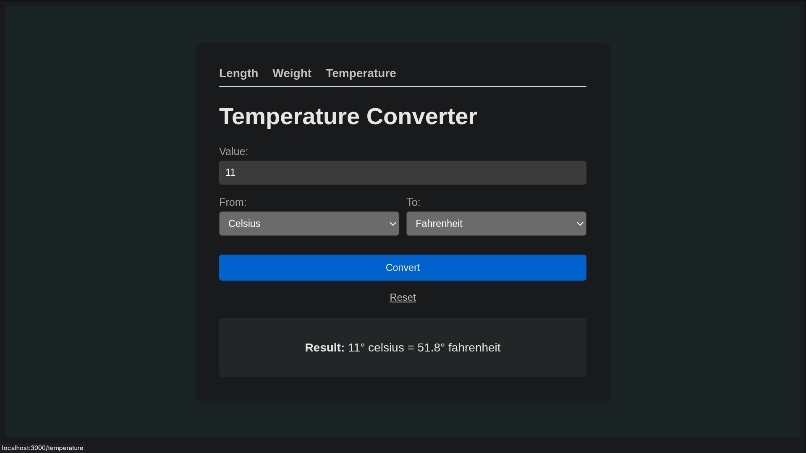

# ⚖️ Unit Converter (SSR)

<p align="center">
  
</p>

A robust, server-side rendered Unit Converter built with **Node.js**, **Express**, and **EJS**. This project focuses on mathematical accuracy and a clean, modular backend architecture.

## 🚀 Features

- **Multi-Category Conversion**: Support for Length, Weight, and Temperature.
- **Base-Unit Engine**: Uses a "Pivot" unit strategy (e.g., converting everything to Meters or Grams first) to ensure math consistency and code maintainability.
- **Server-Side Rendering (SSR)**: Zero frontend frameworks. All logic and HTML generation happen on the server using EJS templates.
- **Input Validation**: Robust server-side checks to handle non-numeric inputs and prevent "NaN" errors.
- **Clean UI**: A minimalist, "handwritten" aesthetic designed for focus and speed.

## 🛠️ Tech Stack

- **Backend**: Node.js, Express
- **Templates**: EJS (Embedded JavaScript)
- **Logic**: TypeScript
- **Styling**: Pure CSS3
- **Development**: tsx (TypeScript Execute), Vitest

## 📐 Architecture: The "Pivot" Strategy

Instead of mapping every unit to every other unit (which grows exponentially), this engine uses a **Pivot Unit** strategy:

1. **Input Unit** → converted to → **Base Unit** (e.g., Meters)
2. **Base Unit** → converted to → **Target Unit**

This reduces the number of conversion ratios from $N^2$ to just $N$, making it trivial to add new units in the future.

## 📦 Installation & Setup

1. **Clone the repository:**

   ```bash
   git clone [https://github.com/Nabil/Unit-Converter.git](https://github.com/Nabil/Unit-Converter.git)
   cd Unit-Converter
   ```

2. **Install dependencies:**

   ```bash
   npm install
   ```

3. **Start the development server:**

   ```bash
   npm run dev
   ```

4. **Open in your browser:**
   Go to `http://localhost:3000`

## 🧪 Testing

The mathematical engines are fully tested to ensure precision:

```bash
npm test
```

---

Built by **Nabil** | April 2026

[Roadmap.sh](https://roadmap.sh/projects/unit-converter)
